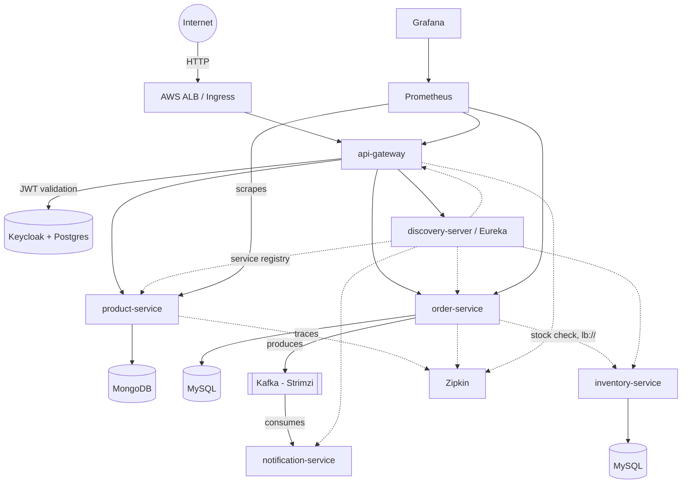
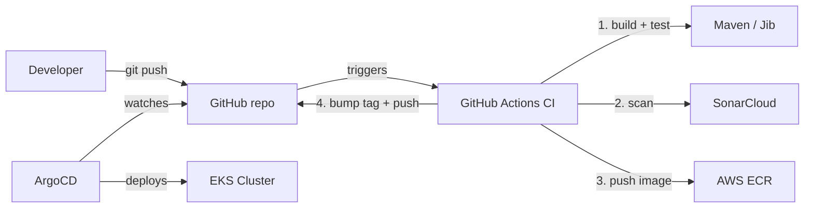

# E-Commerce Microservices — DevOps Platform

A production-shaped, fully GitOps-managed microservices platform running on AWS EKS. Six Spring Boot microservices, three databases, Kafka-based async messaging, Keycloak authentication, full observability, and a hardened CI/CD pipeline — all defined as code and deployed automatically from a single `git push`.

This README is written for someone who has just forked/cloned this repository and needs to get it running from zero, understand why it's built the way it is, and know exactly which gotchas to expect.

---

## 1. What this actually is

- **6 microservices** (Spring Boot / Java 17): `discovery-server` (Eureka), `api-gateway` (Spring Cloud Gateway), `product-service`, `order-service`, `inventory-service`, `notification-service`
- **3 databases**: MongoDB (product-service), MySQL (order-service, inventory-service), PostgreSQL (Keycloak)
- **Kafka** (via Strimzi operator, KRaft mode — no ZooKeeper): order-service produces `OrderPlacedEvent`, notification-service consumes it
- **Keycloak**: centralized authentication/authorization (OAuth2/OIDC), protects `api-gateway` routes
- **Observability**: Prometheus + Grafana (`kube-prometheus-stack`) for metrics, Zipkin for distributed tracing
- **Infrastructure**: Terraform-managed AWS (VPC, EKS, ECR, IAM/OIDC roles, ALB controller)
- **GitOps**: ArgoCD watches this repo and auto-deploys every change
- **CI/CD**: GitHub Actions — build, SonarCloud scan, push image, update Helm chart, auto-deploy

Every deployed component is defined as code in this repository. `kubectl apply`-ing things by hand should never be necessary except for the one-time cluster bootstrap steps described in Section 5.

---

## 2. Architecture



**Deployment/control plane (separate from the runtime diagram above):**



---

## 3. Repository layout

```
.
├── terraform/
│   ├── modules/
│   │   ├── vpc/            # VPC, subnets, NAT (community module)
│   │   ├── eks/            # EKS cluster, node group, EBS CSI driver, addons
│   │   ├── ecr/            # One ECR repo per microservice, IMMUTABLE tags
│   │   ├── iam/            # IAM roles and policies
│   │   ├── github-oidc/    # GitHub Actions OIDC provider + IAM role
│   │   └── alb/            # AWS Load Balancer Controller IAM role (IRSA)
│   └── environment/dev/    # Root module — wires everything together
├── charts/                  # One Helm chart per deployable component
│   ├── discovery-server/ · api-gateway/ · product-service/
│   ├── order-service/ · inventory-service/ · notification-service/
│   ├── mongodb/ · mysql/ · postgres/       # Hand-rolled StatefulSets
│   ├── keycloak/                           # Keycloak deployment
│   ├── kafka/                              # Strimzi Kafka + KafkaNodePool + KafkaTopic
│   └── zipkin/ · monitoring/               # monitoring wraps kube-prometheus-stack
├── argocd/                  # One Application manifest per chart above (13 total)
├── secrets/                 # Kubernetes Secret manifests — gitignored, NEVER committed
├── docs/images/             # Architecture diagrams and output screenshots
├── realms/                  # Keycloak realm export (spring-boot-microservices-realm.json)
├── prometheus/              # Standalone Prometheus config (prometheus.yml)
├── .github/workflows/
│   ├── _reusable-build.yaml    # The actual CI logic (build, scan, push, deploy)
│   └── ci-<service>.yaml       # Thin, path-filtered triggers — one per service
├── discovery-server/ · api-gateway/ · product-service/
├── order-service/ · inventory-service/ · notification-service/
└── README.md
```

**Why this shape:** infrastructure (Terraform), packaging (Helm), and deployment state (ArgoCD-watched manifests) are deliberately separate concerns, even though they live in one repo (a monorepo, by design — see Section 10). CI only ever touches source code and chart `values.yaml`; it never talks to the cluster directly. ArgoCD is the only thing with write access to the cluster.

---

## 4. Prerequisites

Install these locally before doing anything:

| Tool | Purpose |
|---|---|
| `terraform` (≥1.5) | Infrastructure provisioning |
| `aws` CLI, authenticated | AWS access |
| `kubectl` | Cluster interaction |
| `helm` (v3) | Chart installs |
| Java 17 (`openjdk@17`) | **Required** — see Section 9, gotcha #1 |
| `git` | Obviously |

You also need:

- An AWS account with sufficient permissions to create VPCs, EKS clusters, IAM roles, ECR repos, load balancers
- A GitHub repository (your fork) with **Settings → Actions → General → Workflow permissions** set to **"Read and write permissions"** (required for CI to push chart updates back to the repo)
- A [SonarCloud](https://sonarcloud.io) account, connected to your GitHub, with **Automatic Analysis disabled** for this project (Administration → Analysis Method) — otherwise it conflicts with CI-based analysis

---

## 5. First-time setup (fork-specific configuration)

Before running anything, update these fork-specific values:

1. **`terraform/modules/github-oidc/main.tf`** — change the `sub` condition to match your GitHub username/org and repo name:
   ```hcl
   "token.actions.githubusercontent.com:sub" = "repo:<YOUR_GITHUB_USER>@*/<YOUR_REPO_NAME>@*:ref:refs/heads/main"
   ```
   *(Note the `@*` wildcards — modern GitHub OIDC tokens include numeric owner/repo IDs appended with `@`, not just the plain names.)*

2. **`argocd/*.yaml`** — every Application file has `repoURL: https://github.com/<owner>/<repo>.git`. Update all 13 of them to point at your fork.

3. **`.github/workflows/_reusable-build.yaml`** — update the hardcoded AWS account ID (`427064007409` in the original) and `role-to-assume` ARN once you have your own account's values from `terraform output`.

4. **GitHub repo secret** — add `SONAR_TOKEN` (generate from SonarCloud → My Account → Security/Access Tokens) under Settings → Secrets and variables → Actions.

5. **`.github/workflows/_reusable-build.yaml`** — update `sonar.projectKey` / `sonar.organization` to match your SonarCloud project.

---

## 6. Full bootstrap sequence

This is the complete runbook for standing up the entire system from nothing. Run these **in order**.

### 6.1 — Provision infrastructure

```bash
cd terraform/environment/dev
terraform init
terraform plan     # review before applying
terraform apply
```

This creates: VPC (2 AZs, NAT per AZ), EKS cluster (3× nodes by default), ECR repos (one per service, `IMMUTABLE` tags), the EBS CSI driver (needed for any persistent storage), the GitHub OIDC role, the ALB controller's IAM role, and the `ecommerce` namespace.

Save the outputs — you'll need `lb_controller_role_arn`, `vpc_id`, and `eks_cluster_name` shortly.

### 6.2 — Connect kubectl

```bash
aws eks update-kubeconfig --region <your-region> --name <eks_cluster_name>
kubectl get nodes     # confirm all nodes show Ready
```

### 6.3 — Install ArgoCD

```bash
kubectl create namespace argocd
helm repo add argo https://argoproj.github.io/argo-helm
helm repo update
helm install argocd argo/argo-cd --namespace argocd --set server.service.type=LoadBalancer
```

Let this run **to completion without interrupting it** — installing with `LoadBalancer` can take a minute or two before returning control to your terminal; interrupting mid-install leaves a broken Helm release that's genuinely annoying to clean up.

Get access details:

```bash
kubectl get svc argocd-server -n argocd     # EXTERNAL-IP is your login URL
kubectl -n argocd get secret argocd-initial-admin-secret -o jsonpath="{.data.password}" | base64 -d
```

### 6.4 — Apply Secrets (never committed to git — you must recreate these)

Create these files locally (they are `.gitignore`d by design — see Section 8):

```yaml
# secrets/mongodb-secret.yaml
apiVersion: v1
kind: Secret
metadata:
  name: mongodb-credentials
  namespace: ecommerce
type: Opaque
stringData:
  mongodb-root-password: "<choose-a-password>"
  mongodb-username: "dbuser"
  mongodb-password: "<choose-a-password>"
```

Repeat the same pattern for `mysql-secret.yaml` (`mysql-credentials`: `mysql-root-password`, `mysql-database`), `postgres-secret.yaml` (`postgres-credentials`: `postgres-password`, `postgres-db`), and `keycloak-secret.yaml` (`keycloak-credentials`: `admin-username`, `admin-password`). Check each chart's `templates/*.yaml` for the exact keys each Secret must contain — they're referenced there via `secretKeyRef`.

```bash
kubectl apply -f secrets/mongodb-secret.yaml
kubectl apply -f secrets/mysql-secret.yaml
kubectl apply -f secrets/postgres-secret.yaml
kubectl apply -f secrets/keycloak-secret.yaml
```

### 6.5 — Install the Strimzi Kafka operator

```bash
kubectl create namespace kafka
helm repo add strimzi https://strimzi.io/charts/
helm repo update
helm install strimzi-operator strimzi/strimzi-kafka-operator \
  --namespace kafka \
  --set watchNamespaces="{ecommerce}"
```

**Do not skip `watchNamespaces`.** Without it, the operator only watches its own namespace and will silently never reconcile the `Kafka`/`KafkaNodePool`/`KafkaTopic` resources living in `ecommerce`. If you install this without the flag and only add it via `helm upgrade` afterward, you must also `kubectl rollout restart deployment strimzi-cluster-operator -n kafka` — a Helm value change alone does not force a pod restart.

### 6.6 — Install the Prometheus Operator CRDs

`kube-prometheus-stack`'s CRDs for `Prometheus` and `Alertmanager` are too large for a normal `kubectl apply` (they exceed Kubernetes' 262144-byte last-applied-configuration annotation limit). Install them directly:

```bash
kubectl create -f https://raw.githubusercontent.com/prometheus-operator/prometheus-operator/main/example/prometheus-operator-crd/monitoring.coreos.com_prometheuses.yaml
kubectl create -f https://raw.githubusercontent.com/prometheus-operator/prometheus-operator/main/example/prometheus-operator-crd/monitoring.coreos.com_alertmanagers.yaml
kubectl create -f https://raw.githubusercontent.com/prometheus-operator/prometheus-operator/main/example/prometheus-operator-crd/monitoring.coreos.com_alertmanagerconfigs.yaml
kubectl create -f https://raw.githubusercontent.com/prometheus-operator/prometheus-operator/main/example/prometheus-operator-crd/monitoring.coreos.com_prometheusagents.yaml
kubectl create -f https://raw.githubusercontent.com/prometheus-operator/prometheus-operator/main/example/prometheus-operator-crd/monitoring.coreos.com_scrapeconfigs.yaml
kubectl create -f https://raw.githubusercontent.com/prometheus-operator/prometheus-operator/main/example/prometheus-operator-crd/monitoring.coreos.com_thanosrulers.yaml
```

(This is exactly why `argocd/monitoring-app.yaml` has `helm: skipCrds: true` set — ArgoCD's own Helm sync hits the same size limit if it tries to manage these CRDs itself.)

### 6.7 — Install the AWS Load Balancer Controller

```bash
helm repo add eks https://aws.github.io/eks-charts
helm repo update
helm install aws-load-balancer-controller eks/aws-load-balancer-controller \
  --namespace kube-system \
  --set clusterName=<eks_cluster_name> \
  --set serviceAccount.create=true \
  --set serviceAccount.name=aws-load-balancer-controller \
  --set serviceAccount.annotations."eks\.amazonaws\.com/role-arn"="<lb_controller_role_arn>" \
  --set region=<your-region> \
  --set vpcId=<vpc_id>
```

Use the actual values from your `terraform output`.

### 6.8 — Deploy everything via GitOps

```bash
kubectl apply -f argocd/
kubectl get applications -n argocd
kubectl get pods -n ecommerce -w
```

This applies all 13 Application manifests. ArgoCD takes it from here — every chart in `charts/` gets deployed automatically, and stays in sync with this repo going forward. Give it several minutes; some services depend on databases being ready first.

### 6.9 — Bootstrap Keycloak (one-time, cannot be automated via GitOps)

Keycloak's realm/client/user data lives inside its Postgres database, not in Kubernetes manifests — this step is inherently manual.

```bash
kubectl port-forward svc/keycloak 8080:8080 -n ecommerce
```

Open `http://localhost:8080` → Administration Console → log in with the credentials from your `keycloak-secret.yaml`.

1. **Create a Realm**: click into the "Realm name" field directly first (avoid pasting to prevent invisible whitespace — see Section 9, gotcha #10), type the name exactly. Match whatever `SPRING_SECURITY_OAUTH2_RESOURCESERVER_JWT_ISSUER_URI` expects in `charts/api-gateway/templates/deployment.yaml` (default: `spring-boot-microservices-realm`).
2. **Create a Client**: Client ID `api-gateway`, Client Authentication **ON**, Valid Redirect URIs `*` (tighten this for real production use).
3. **Create a User**: any username, set a password under the Credentials tab with **Temporary: OFF**.

Alternatively, you can import the pre-exported realm from `realms/spring-boot-microservices-realm.json` via Keycloak's "Create Realm" → "Browse..." import feature — but you'll still need to create a user and set the client secret manually.

---

## 7. Verifying the system works

### 7.1 — Check everything is running

```bash
kubectl get pods -n ecommerce
kubectl get applications -n argocd
```

Every pod should show `1/1 Running` (or `2/2` for the Kafka entity operator).

### 7.2 — Get the public URL

```bash
kubectl get ingress -n ecommerce
```

This is a real, public AWS ALB — open it in any browser: `http://<address>/eureka/web` shows the Eureka dashboard with every service registered `UP`.

### 7.3 — Test an authenticated API call

**Important:** fetch the token from *inside* the cluster, not via a local port-forward — see Section 9, gotcha #9 for why this matters.

```bash
kubectl run curl-test --image=curlimages/curl -it --rm --restart=Never -n ecommerce -- sh
```

Inside the pod:

```bash
TOKEN=$(curl -s -X POST http://keycloak:8080/realms/<realm>/protocol/openid-connect/token \
  -d "client_id=api-gateway" \
  -d "client_secret=<your-client-secret>" \
  -d "grant_type=password" \
  -d "username=<your-user>" \
  -d "password=<your-password>" | sed 's/.*"access_token":"\([^"]*\)".*/\1/')

curl -H "Authorization: Bearer $TOKEN" http://api-gateway:8181/api/product
```

### 7.4 — Test the Kafka flow

In one terminal:

```bash
kubectl logs -f -l app=notification-service -n ecommerce
```

In another (inside a debug pod, same token as above):

```bash
curl -X POST http://api-gateway:8181/api/order \
  -H "Authorization: Bearer $TOKEN" -H "Content-Type: application/json" \
  -d '{"orderLineItemsDtoList":[{"skuCode":"sku-001","price":29.99,"quantity":1}]}'
```

You should see `Received Notification for Order - <uuid>` appear in the first terminal within seconds — proof the full async event flow works.

### 7.5 — Observability

```bash
kubectl port-forward svc/monitoring-grafana 3000:80 -n monitoring
```

Open `http://localhost:3000`, log in with the credentials from the `monitoring-grafana` Secret (`kubectl get secret monitoring-grafana -n monitoring -o jsonpath="{.data.admin-password}" | base64 -d`).

---

## 8. Secrets management

**Nothing sensitive ever lives in this repository.** `secrets/` is listed in `.gitignore`. Every Secret referenced by a Helm chart (`secretKeyRef`) must be created manually, once per fresh cluster, using the templates in Section 6.4. This is a deliberate, minimal middle ground — real production use should replace this with External Secrets Operator or Sealed Secrets, pulling from AWS Secrets Manager, rather than locally-authored plaintext files.

Before every `git commit`, especially after touching anything Secret-adjacent, verify:

```bash
git status              # confirm secrets/*.yaml never appears
git log --oneline -- secrets/    # should always be empty
```

---

## 9. Known gotchas (read this before you hit them yourself)

This project was built through genuine, hands-on debugging. These are real issues, not hypotheticals — anyone forking this will hit at least some of them.

1. **Java version matters — a lot.** This project's Lombok version historically breaks under very new JDKs (confirmed on Java 26; also required a Lombok version pin to `1.18.34`+ for Java 21 compatibility, needed by the SonarCloud scanner). CI installs both Java 17 (app builds) and Java 21 (SonarCloud scanner) side by side and explicitly sets `JAVA_HOME`/`PATH` per step — don't remove that split.

2. **`terraform destroy` wipes ECR.** Every image you've ever pushed disappears. After any fresh `terraform apply`, all 6 services' `charts/*/values.yaml` will reference tags that no longer exist, and pods will show `ImagePullBackOff` until CI rebuilds and pushes fresh images (trigger by committing any change inside each service's source folder).

3. **EKS node group `desired_size` is ignored by Terraform after initial creation.** This is deliberate upstream behavior in the `terraform-aws-modules/eks` module (so an autoscaler can own it without Terraform fighting it). To scale node count after the first `apply`, use the AWS CLI directly:
   ```bash
   aws eks update-nodegroup-config --cluster-name <name> --nodegroup-name <actual-name-with-suffix> \
     --scaling-config minSize=1,maxSize=4,desiredSize=3
   ```
   (Get the actual node group name via `aws eks list-nodegroups --cluster-name <name>` — it has a generated suffix, not just `default`.)

4. **Postgres needs an init container, or it will crash-loop forever.** Mounting an EBS volume directly at `/var/lib/postgresql/data` leaves a Linux-created `lost+found` directory there, and `initdb` refuses to initialize a non-empty directory. The `postgres` chart's StatefulSet uses `PGDATA=/var/lib/postgresql/data/pgdata` plus an `initContainer` that runs `mkdir -p .../pgdata && chown -R 999:999 ...` before the main container starts. Don't remove this.

5. **Eureka registers pods by hostname by default — and Kubernetes can't resolve that.** Any service that gets called *by* another service through Eureka's client-side load balancer (`lb://service-name`) must set `EUREKA_INSTANCE_PREFER_IP_ADDRESS: "true"`, or api-gateway/order-service will throw `UnknownHostException` trying to resolve an unresolvable pod hostname. This is currently set on `product-service`, `order-service`, and `inventory-service` — if you add a new backend service, add this env var too.

6. **Spring Cloud Gateway route URIs can't be reliably overridden via environment variables.** Partially overriding one field of an indexed `spring.cloud.gateway.routes[N]` list property via env vars causes a hard startup failure (`elements were left unbound`), even when every field of that route is supplied. Fix any hardcoded `localhost` routes directly in `application.properties` in source, not via Helm env var injection.

7. **Strimzi's operator caches CRD availability at startup.** If you install the operator before its CRDs exist (or the reverse — CRDs before the operator has a chance to see them), it logs `resource "X" not installed in the cluster` once and never rechecks. `kubectl rollout restart deployment strimzi-cluster-operator -n kafka` (or the Prometheus operator's deployment) after installing/fixing CRDs.

8. **`kube-prometheus-stack`'s Prometheus/Alertmanager CRDs are too large for `kubectl apply`.** Use `kubectl create` (first install) or `kubectl apply --server-side` (updates) instead — see Section 6.6. ArgoCD's Application for this chart has `helm.skipCrds: true` for the same reason; don't remove it unless you also fix CRD management some other way.

9. **A JWT's `iss` (issuer) claim is baked in based on the hostname you requested the token from.** If you fetch a token via `localhost:8080` (port-forward) but `api-gateway` is configured to trust `http://keycloak:8080/...` (internal DNS), the token will be rejected with `invalid_token: The iss claim is not valid`. Always fetch test tokens from *inside* the cluster (a debug pod) if you're testing against the internally-configured issuer.

10. **Type realm names directly into Keycloak's UI — don't paste.** A pasted realm name once picked up invisible leading whitespace, creating a realm whose actual stored name (`"   spring-boot-microservices-realm"`) never matched what any client requested (`spring-boot-microservices-realm`), causing a persistent, confusing `Realm does not exist` error. If this happens, delete and recreate the realm, typing the name character by character.

11. **CI pushes to `main` can race each other.** When multiple services' pipelines run concurrently (e.g., triggered by one commit touching several folders), each one's final step commits an updated `values.yaml` back to `main`. The reusable workflow's push step wraps this in a retry loop (`git pull --rebase && git push`, retried up to 5 times with jitter) specifically to handle this — don't remove the retry loop even if it looks redundant on a quiet repo.

12. **SonarCloud's Automatic Analysis must be disabled** if the project was auto-imported from GitHub, or CI-based scans fail with `You are running CI analysis while Automatic Analysis is enabled`.

13. **This repo uses a single, shared SonarCloud project across all 6 services** (per-service projects weren't achievable through the account's available auto-import flow). This means the SonarCloud dashboard always reflects whichever service's pipeline ran *most recently* — it is not a combined view. Every service is genuinely scanned on every push; check the project's Activity tab for full history if you need to see a specific service's past results.

14. **CI skips tests (`-DskipTests`) during the SonarCloud step.** The integration tests in this project expect a live database connection that doesn't exist in the GitHub Actions runner. A more complete setup would add service containers (ephemeral MySQL/Mongo) to the CI job — this repo intentionally accepts the gap rather than rushing that setup.

---

## 10. Design decisions worth understanding

- **Monorepo, not multi-repo.** All 6 services, infra, charts, and CI live in one repository. This trades some isolation for simplicity; path-filtered CI triggers (`paths:` in each `ci-<service>.yaml`) keep builds scoped to only the service that actually changed.

- **One shared reusable CI workflow, not 6 duplicated ones.** `_reusable-build.yaml` holds all real logic; the 6 `ci-<service>.yaml` files are ~10-line callers. Fix a bug once, it's fixed everywhere.

- **GitOps boundary is deliberate.** Terraform provisions infrastructure and bootstraps cluster-level operators (ArgoCD, Strimzi, the LB controller) — but does **not** manage ArgoCD's own Applications or their lifecycle. That boundary is intentionally kept manual/scripted rather than folded into Terraform, to avoid two systems fighting over ownership of the same resources.

- **Community Helm charts where genuinely appropriate, hand-rolled where instructive.** MongoDB/MySQL/Postgres are hand-written StatefulSets (a deliberate choice to understand the primitives). `kube-prometheus-stack` is a community dependency (reinventing Prometheus Operator would teach little and risk much). Ansible was deliberately **not** used — this project has no long-lived VM provisioning need that would justify it; Kubernetes/Helm already fill that role.

- **Immutable ECR tags, git-SHA based.** No image is ever overwritten once pushed — every deployed tag traces back to an exact commit.

---

## 11. Tearing down (to stop billing)

```bash
kubectl delete svc argocd-server -n argocd    # release the ALB cleanly first
cd terraform/environment/dev
terraform destroy
```

Deleting the LoadBalancer-type Services *before* destroying Terraform avoids orphaned AWS load balancers blocking VPC/subnet deletion. Remember: this wipes ECR, all persistent volumes, and every running resource — this repo (and its `secrets/` templates, kept locally) is what lets you rebuild the entire system from nothing in about 20–30 minutes.

---

## 12. License

Add your license of choice here.
